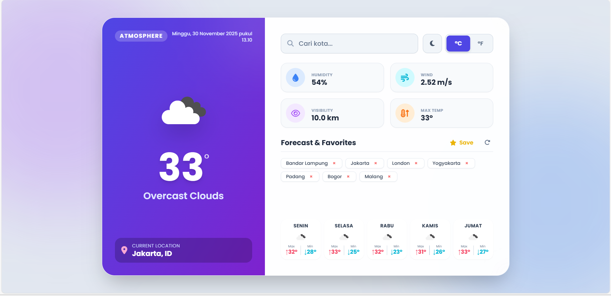
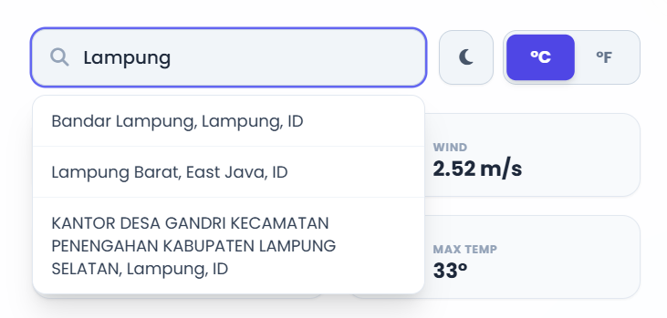
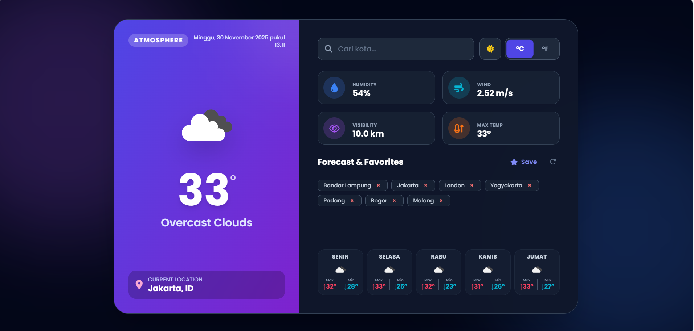
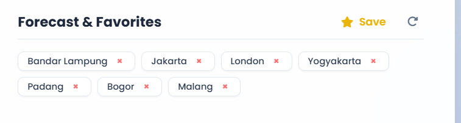
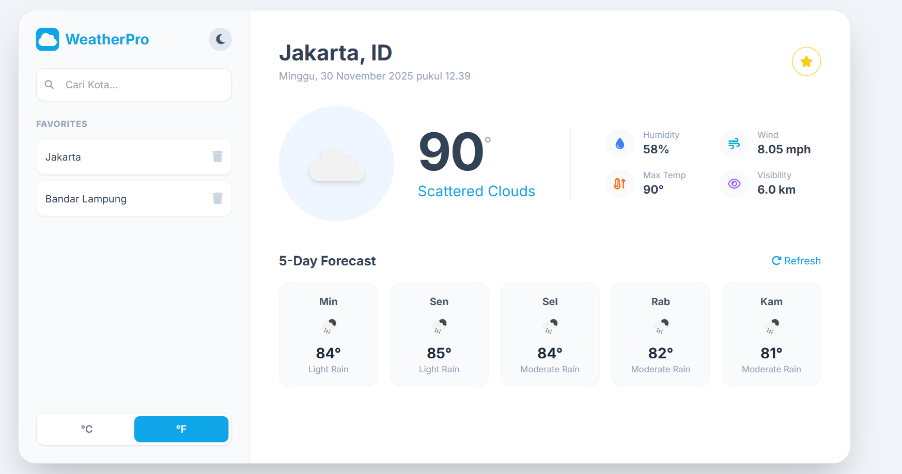
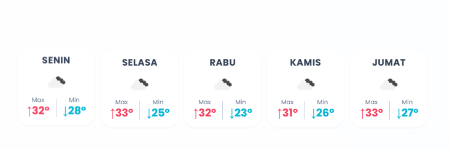

# 🌦️ Atmosphere Weather - Final Project

Aplikasi Weather Dashboard modern dengan antarmuka Aurora Glassmorphism yang futuristik dan responsif. Dibangun untuk memenuhi Tugas Akhir Mata Kuliah Pemrograman Web.

**Teknologi:** HTML5, Vanilla JavaScript, Tailwind CSS (CDN).

---

## ✨ Fitur Unggulan

### 1. 🔍 Pencarian Cerdas (Smart Search)
Dilengkapi dengan Auto-complete yang memberikan saran kota secara *real-time* saat pengguna mengetik.

### 2. 🌙 Mode Gelap (Dark Mode)
Mendukung tema gelap dengan penyesuaian kontras tinggi agar data tetap mudah dibaca dalam kondisi minim cahaya.

### 3. ⭐ Manajemen Kota Favorit
Simpan kota yang sering dipantau ke dalam daftar Favorit. Data tersimpan permanen di browser (*Local Storage*).

### 4. 🌡️ Konversi Satuan & Detail Cuaca
* Toggle C/F: Tombol gaya *Segmented Control* untuk mengubah satuan suhu.
* Detail Ikon Visualisasi data Kelembaban, Angin, dan Jarak Pandang dengan ikon berwarna.

### 5. 📅 Ramalan Cuaca (Forecast) Akurat
Menampilkan prediksi cuaca untuk 5 hari ke depan (Senin-Jumat) dengan kalkulasi suhu Minimum (Min) dan Maksimum (Max harian.

---

**Tugas Akhir - Pemrograman Web**
